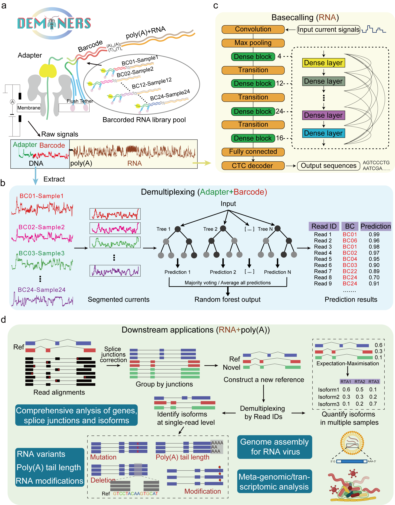

# DEMINERS

**DEMINERS (<u>D</u>emultiplexing and <u>E</u>valuation using <u>M</u>achine-learning <u>I</u>ntegrated in <u>N</u>anopor<u>e</u> direct <u>R</u>NA <u>S</u>equencing) enables clinical metagenomics and comparative transcriptomic analysis by increasing throughput and accuracy of nanopore direct RNA sequencing**. 

Nanopore direct RNA sequencing (DRS) advances RNA biology but is limited by relatively low basecalling accuracy, low throughput, yet high RNA input and costs. 

Here we introduce a novel DRS toolkit, `DEMINERS`, which integrates <u>an RNA multiplexing experimental workflow</u>, <u>a machine-learning barcode classifier based on Random Forest</u> and <u>a novel basecaller built on an optimized convolutional neural network</u> providing an additional species-specific training module. With the increased accuracy in barcode classification and basecalling, DEMINERS can demultiplex up to 24 samples and the required RNA input and running time are both substantially reduced. We demonstrated the applications of DEMINERS in clinical metagenomics, cancer transcriptomics and parallel comparison of transcriptomic features in different biological conditions, revealing a potential role of m6A in increasing transcriptomic diversity in glioma and the mature blood-stage of malaria parasites. 

Overall, DEMINERS is a simple, robust and high-throughput DRS method for accurately estimating transcript levels, poly(A) lengths, and mutation and RNA modification heterogeneity at single-read level, with minimal sequencing biases.


## Contents

- [Overview](#Overview)
- [Requirements](#Requirements)
- [Installation](#Installation)
- [Tutorial](#Tutorial)
- [Citing](#Citing)
- [License](#License)
- [Reference](#References )
- [Supplementary](#Supplementary)


## <span id="Overview">Overview</span>

`DEMINERS` integrates three components: 

1. A multiplexing experimental workflow and the associated classifier named `DecodeR` utilizing a machine-learning algorithm based on Random Forest (**Fig. a, b**).

2. A novel base-caller named `Densecall` is built on an optimized DenseNet-inspired convolutional neural network (**Fig. c**).

3. The downstream data analysis for comprehensive isoform profiling, RNA variant and modification identification, and metagenomic and RNA virome analyses (**Fig. d**).




 ## <span id="Requirements">Requirements</span>

#### Hardware Requirements

`Densecall` and `DecodeR` require a standard computer with sufficient RAM to support user-defined operations. Specific hardware requirements include:

- **RAM**: 2 GB minimum, 16 GB or more recommended for optimal performance.
- **CPU**: 4 cores minimum, 2.3 GHz or faster per core.
- **GPU**: NVIDIA 2080Ti or better (required specifically for `Densecall` for computational tasks).

The performance benchmarks are based on a system with 16 GB RAM, 8 cores @ 2.3 GHz each, and an internet connection speed of 25 Mbps. Model training was performed on an ASUS TS700-E9-RS8 server, equipped with 2.20 GHz Intel® Xeon® Silver 4214 CPUs, 500 GB of RAM, and an Nvidia 2080Ti GPU with 10 GB of memory.

#### Software Requirements

**Operating Systems Supported:**

- Linux: Ubuntu 20.04 or later
- Windows 10 or later
- macOS: Mojave (10.14) or later

**For `Densecall`**:
Ensure `Python` 3.7.0 or higher is installed. Install `Python` on Ubuntu using:

```shell
sudo apt update
sudo apt install python3
sudo apt install python3-pip
```

**For `DecodeR`**:
Ensure `R` version 3.6.0 or higher is installed. Install `R` on Ubuntu using:

```shell
sudo echo "deb http://cran.rstudio.com/bin/linux/ubuntu xenial/" | sudo tee -a /etc/apt/sources.list
gpg --keyserver keyserver.ubuntu.com --recv-key E084DAB9
gpg -a --export E084DAB9 | sudo apt-key add -
sudo apt-get update
sudo apt-get install r-base r-base-dev
```


## <span id="Installation">Installation</span>

This guide provides step-by-step instructions for two installation methods:

1. **Docker Installation** — for an easy, containerized setup.

​	We provided a Docker image on Docker Hub that you can pull and run directly.

```shell
docker pull lianlin/deminers:latest
docker run -it --gpus all --rm --name deminers-container lianlin/deminers
```

2. **Manual Installation** — for installing Densecall and DecodeR manually.


### 1. **Docker Installation**

Follow the steps below to install Docker, set up NVIDIA Docker for GPU support, and run a Docker container.

- **Note 1:** If Docker is not installed on your system, you can install it by following the instructions in the [official Docker documentation](https://docs.docker.com/engine/install/).
- **Note 2:** For GPU support in Docker, refer to the [Docker GPU support guide](https://docs.docker.com/desktop/features/gpu/) and the [NVIDIA Container Toolkit installation guide](https://docs.nvidia.com/datacenter/cloud-native/container-toolkit/latest/install-guide.html).
- **Note 3:** For detailed docker installation logs, see [log file]( ./doc/Install_docker_test2_log.txt).

#### Step 1: Install Docker

Run the following commands to install Docker on Ubuntu:

```shell
# Update package list and install dependencies
sudo apt-get update
sudo apt-get install -y apt-transport-https ca-certificates curl software-properties-common

# Add Docker’s official GPG key
curl -fsSL https://download.docker.com/linux/ubuntu/gpg | sudo apt-key add -

# Set up Docker’s stable repository
sudo add-apt-repository "deb [arch=amd64] https://download.docker.com/linux/ubuntu $(lsb_release -cs) stable"

# Update package list again and install Docker
sudo apt-get update
sudo apt-get install -y docker-ce
```

#### Step 2: Install NVIDIA Docker (for GPU support)

To enable GPU support in Docker, follow these steps:

```shell
# Set up the distribution for NVIDIA Docker
distribution=$(. /etc/os-release; echo $ID$VERSION_ID)

# Add NVIDIA's GPG key
curl -s -L https://nvidia.github.io/nvidia-docker/gpgkey | sudo apt-key add -

# Set up the NVIDIA Docker repository
curl -s -L https://nvidia.github.io/nvidia-docker/$distribution/nvidia-docker.list | sudo tee /etc/apt/sources.list.d/nvidia-docker.list

# Update package list and install NVIDIA Docker
sudo apt-get update
sudo apt-get install -y nvidia-docker2

# Restart Docker service to apply changes
sudo systemctl restart docker
```

#### Step 3: Run the Docker Container

You can now pull directly and run a Docker container with GPU support:

```shell
# Switch to the Docker group (to run Docker without sudo)
newgrp docker

# Pull the Docker image
docker pull lianlin/deminers:latest

# Run the Docker container with GPU support
docker run -it --gpus all --rm --name deminers-container lianlin/deminers
```

#### (Optional): Build Docker Locally (if pull fails)

If you encounter a "Timeout exceeded" error while pulling the image, you can build the Docker image locally instead:

```shell
# Build the Docker image from the Dockerfile
docker build -t deminers -f Dockerfile .

# Run the Docker container with GPU support
docker run -it --gpus all --rm --name deminers-container deminers
```


------

### 2. **Manual Installation (Densecall and DecodeR)**

If you prefer to install **Densecall** and **DecodeR** manually, follow these steps:

#### Densecall

First, set up a new environment and install the necessary Python packages using conda and pip:

```shell
# Create a new conda environment
conda create -n densecall python=3.9
conda activate densecall

# Upgrade pip
pip install --upgrade pip

# Download and install 
git clone https://github.com/LuChenLab/DEMINERS.git
cd DEMINERS/Densecall
pip install -r requirements.txt
python setup.py develop
```

Densecall is compatible with the basecaller of ont-bonito, allowing our trained models to be used for the basecalling process. Install ont-bonito as follows:

```shell
cd ont-bonito-0.7.3
python setup.py develop
```

#### **DecodeR**

Before installing `DecodeR`, install the necessary R packages. These packages are required for optimal functionality:

- [changepoint_2.2.2](https://CRAN.R-project.org/package=changepoint)
- [data.table_1.14.0](https://cran.r-project.org/web/packages/data.table/)
- [randomForest_4.6-14](https://cran.r-project.org/web/packages/randomForest/index.html)
- [rhdf5_2.36.0](https://www.bioconductor.org/packages/release/bioc/html/rhdf5.html)
- [smoother_1.1](https://rdrr.io/cran/smoother/man/smoother.html)
- [caret_6.0-90](https://CRAN.R-project.org/package=caret)

Users should install the previously mentioned packages prior to installing `DecodeR`, from an `R` terminal:

```R
# Install necessary packages from CRAN
packages <- c('changepoint', 'data.table', 'randomForest', 'smoother', 'caret')
new_packages <- packages[!(packages %in% installed.packages()[,"Package"])]
if(length(new_packages)) install.packages(new_packages)

# Install packages from Bioconductor
if (!requireNamespace("BiocManager", quietly = TRUE))
    install.packages("BiocManager")
BiocManager::install("rhdf5")
```

To install `DecodeR`, you have two options: either install directly from GitHub or use the compressed source file:

```R
# Install from GitHub if remotes package is not installed
if (!requireNamespace("remotes", quietly = TRUE))
    install.packages("remotes")

remotes::install_github("LuChenLab/DEMINERS/DecodeR")
```

Alternatively, you can install `DecodeR` using the source file downloaded from the [repository](https://github.com/LuChenLab/DEMINERS/blob/main/DecodeR_0.1.0.tar.gz) :

```shell
# Install DecodeR from a downloaded source file
R CMD INSTALL DecodeR_0.1.0.tar.gz
```


## <span id="Tutorial">Tutorial</span>

This tutorial will guide you through using DEMINERS for your RNA analysis. It is divided into four main parts: setting up your multiplexing experiment, performing base calling, demultiplexing your reads by barcode, and conducting downstream analysis. 

### 1. Multiplexing experimental workflow

To start your multiplexing experiment, select the appropriate RTA combination from the table below based on the model that fits your experimental design. Ensure you have all the necessary RTAs before beginning your experiment. 

| Model_name | RTA_list                                                     |
| ---------- | ------------------------------------------------------------ |
| model2     | RTA-33,RTA-35                                                |
| model4     | RTA-21,RTA-33,RTA-35,RTA-40                                  |
| model6     | RTA-03,RTA-21,RTA-26,RTA-33,RTA-35,RTA-40                    |
| model8     | RTA-03,RTA-08,RTA-10,RTA-21,RTA-26,RTA-33,RTA-35,RTA-40      |
| model10    | RTA-03,RTA-08,RTA-10,RTA-21,RTA-24,RTA-26,RTA-33,RTA-35,RTA-36,RTA-40 |
| model12    | RTA-03,RTA-06,RTA-08,RTA-10,RTA-21,RTA-24,RTA-26,RTA-32,RTA-33,RTA-35,RTA-36,RTA-40 |
| model14    | RTA-03,RTA-06,RTA-08,RTA-10,RTA-17,RTA-19,RTA-21,RTA-24,RTA-26,RTA-32,RTA-33,RTA-35,RTA-36,RTA-40 |
| model16    | RTA-03,RTA-06,RTA-08,RTA-10,RTA-12,RTA-16,RTA-17,RTA-19,RTA-21,RTA-24,RTA-26,RTA-32,RTA-33,RTA-35,RTA-36,RTA-40 |
| model18    | RTA-03,RTA-06,RTA-08,RTA-10,RTA-12,RTA-16,RTA-17,RTA-19,RTA-21,RTA-24,RTA-26,RTA-32,RTA-33,RTA-35,RTA-36,RTA-37,RTA-40,RTA-42 |
| model20    | RTA-03,RTA-06,RTA-08,RTA-10,RTA-12,RTA-16,RTA-17,RTA-19,RTA-21,RTA-24,RTA-26,RTA-27,RTA-29,RTA-32,RTA-33,RTA-35,RTA-36,RTA-37,RTA-40,RTA-42 |
| model22    | RTA-03,RTA-06,RTA-08,RTA-10,RTA-12,RTA-15,RTA-16,RTA-17,RTA-19,RTA-21,RTA-24,RTA-26,RTA-27,RTA-28,RTA-29,RTA-32,RTA-33,RTA-35,RTA-36,RTA-37,RTA-40,RTA-42 |
| model24    | RTA-03,RTA-06,RTA-08,RTA-09,RTA-10,RTA-12,RTA-16,RTA-21,RTA-22,RTA-24,RTA-26,RTA-27,RTA-28,RTA-29,RTA-31,RTA-32,RTA-33,RTA-35,RTA-36,RTA-37,RTA-39,RTA-40,RTA-45,RTA-46 |


### 2. Split Fast5/Fastq file by barcode

Split the `.fast5`  or `.fastq` file by barcode for easier handling and analysis. The procedure involves barcode prediction, handling output formats, and the actual splitting of files.

#### **Command-Line Usage**

You can run **DecodeR** via command line using the following script:

```shell
git clone https://github.com/LuChenLab/DEMINERS.git
cd DEMINERS
Rscript DecodeR.R -I fast5 -M model --cores 1 -O output.tsv
```

The `DecodeR` command includes several options:

| Option                 | Description                                                  |
| ---------------------- | ------------------------------------------------------------ |
| `-I, --fast5`          | Path to the .fast5 file [default = `NULL`]                   |
| `-M, --model`          | The path of the pretrained model [default = `NULL`]. Utilize pre-trained models for barcode detection available from [Pre-trained demultiplexing models](https://figshare.com/articles/online_resource/DecodeR_Models/22678729). |
| `--cores`              | Number of cores to use (maximum number of simultaneous child processes) [default = `1`] |
| `-t, --cutoff`         | Cutoff for minimum probability for classified reads (higher for accuracy, lower for recovery) [default = `0`] |
| `-l, --include.lowest` | Include lowest probability reads [default = `FALSE`]         |
| `-O, --output_file`    | Path and filename for output [default = `NULL`]              |
| `-h, --help`           | Show this help message and exit                              |

#### **Distributed R-based Workflow**

##### Step 1: Barcode prediction

Utilize pre-trained models for barcode detection available from [Pre-trained demultiplexing models](https://figshare.com/articles/online_resource/DecodeR_Models/22678729). Predict the barcode using `DecodeR` as shown:

```R
library(DecodeR)

# get example file from package
fast5file <- system.file("extdata/demo2_0.fast5", package = "DecodeR")

# load in the model, limited by file size only the 2 barcodes model were built into the package
data("Model_2barcodes.RData")

# predict the barcode of example fast5 file
pred <- DecodeR(fast5 = fast5file, model = Model_2barcodes) # about 10 seconds
```

The **DecodeR()** function includes several important parameters:

| Argument         | Description                                                  |
| ---------------- | ------------------------------------------------------------ |
| `fast5`          | Path to the input **Fast5** file.                            |
| `model`          | Pre-trained barcode prediction model.                        |
| `NT`             | Number of CPU cores to use for parallel processing.          |
| `cutoff`         | Minimum probability threshold [0-1] for classified reads (higher for accuracy, lower for recall). |
| `include.lowest` | Whether to include the lowest probability reads in classification. |
| `clear`          | If `TRUE`, performs a clean output.                          |

##### Step 2: Handing output formats

Inspect the prediction output and histogram of probabilities:

```R
head(pred)
#                                         Read Barcode Probability
# 1: read_0b3cabf5-44b4-4438-86df-4dfa672000e1  RTA-33       1.000
# 2: read_0d11e3c0-00ca-4531-a7fc-55fc75d3bb1f  RTA-33       1.000
# 3: read_10cefe5e-6441-4c80-ba98-dbd50c4d6cf3  RTA-33       1.000
# 4: read_12b81f83-f74f-4c45-b6b5-7e7168546ddb  RTA-33       1.000
# 5: read_160d5209-db4c-463c-9e1c-813e0d8e8737  RTA-35       0.994
# 6: read_180def1e-e4cb-4f8b-85de-100e7fd584f9  RTA-33       0.958
# histogram of predicted probability
hist(pred$Probability, xlab = "Probability", main = "Histogram of Probability")

# number of each barcode
table(pred$Barcode)
# RTA-33 RTA-35
#     39     19
```

To handle reads with low prediction confidence:

```R
# set cutoff for unclassified read
pred2 <- DecodeR(fast5 = fast5file, model = Model_2barcodes, cutoff = 0.8)
table(pred2$Barcode)
#      RTA-33       RTA-35 unclassified
#          37           19            2
```

##### Step 3: File splitting

Split the `.fastq` files using `ShortRead`:

```R
BiocManager::install("ShortRead") # The Bioconductor Package ShortRead was dependent for spliting fastq file
library(ShortRead)
fq <- ShortRead::readFastq("/path/to/fastq/file/*.fastq")
R2B <- with(pred2, split(Read, Barcode))

for(i in seq_along(R2B)) {
  fqi <- fq[mapply(function(x) x[1], strsplit(as.character(ShortRead::id(fq)), " ")) %in% gsub("read_", "", R2B[[i]])]
  ShortRead::writeFastq(object = fqi, file = paste0("/path/to/split/fastq/file", names(R2B)[i], ".fastq"))
}
```

| File name                  | File size | Description                                            |
| -------------------------- | --------- | ------------------------------------------------------ |
| `fastq/RTA-33.fastq`       | 22 KB     | Sequences that were classified as `RTA-33` barcode.    |
| `fastq/RTA-35.fastq`       | 9 KB      | Sequences that were classified as `RTA-35` barcode.    |
| `fastq/unclassified.fastq` | 1 KB      | Sequences that could not be classified as any barcode. |


##### Version Information

The version information about **R**, the OS and attached or loaded packages for this `Demo` analysis:

```R
sessionInfo()
# R version 4.1.0 (2021-05-18)
# Platform: x86_64-apple-darwin17.0 (64-bit)
# Running under: macOS Big Sur 10.16
# 
# Matrix products: default
# BLAS:   /Library/Frameworks/R.framework/Versions/4.1/Resources/lib/libRblas.dylib
# LAPACK: /Library/Frameworks/R.framework/Versions/4.1/Resources/lib/libRlapack.dylib
# 
# locale:
# [1] zh_CN.UTF-8/zh_CN.UTF-8/zh_CN.UTF-8/C/zh_CN.UTF-8/zh_CN.UTF-8
# 
# attached base packages:
# [1] stats     graphics  grDevices utils     datasets  methods   base
# 
# other attached packages:
# [1] DecodeR_0.1.0
# 
# loaded via a namespace (and not attached):
# [1] zoo_1.8-9          compiler_4.1.0     parallel_4.1.0     rhdf5_2.36.0
# [5] xts_0.12.1         curl_4.3.2         rhdf5filters_1.4.0 grid_4.1.0
# [9] data.table_1.14.0  changepoint_2.2.2  TTR_0.24.2         smoother_1.1
# [13] lattice_0.20-44    Rhdf5lib_1.14.2   ShortRead_1.50.0
```


### 3. Basecalling of FAST5 files

After installing `Densecall`, you can download pre-trained models for both general and mouse-specific applications from [Pre-trained basecalling models](https://figshare.com/articles/dataset/Densecall_models/25712856). 

Available models: 

- **General model:** `rna_r9.4.1_hac@v1.0.tar.gz`
- **Mouse-specific model:** `rna_mouse_r9.4.1_hac@v1.0.tar.gz`

`Densecall` provides a method for transforming `.fast5` files into `.fastq` format. Follow the commands below to perform basecalling:

```shell
# Activate the Densecall conda environment
conda activate densecall

# Navigate to the directory where you want to download the models
cd /path/to/DEMINERS/Densecall/densecall/models/

# Download and extract the models
# Note: Ensure you have already downloaded the .tar.gz files to this directory
tar -xzvf rna_r9.4.1_hac@v1.0.tar.gz 

# Perform basecalling on the .fast5 files to generate .fastq files
densecall basecaller --amp --output-file basecalls.fastq \
                     rna_r9.4.1_hac@v1.0 /path/to/fast5_data/
```

The `densecall basecaller` command includes several options:

| Option            | Description                                                  |
| ----------------- | :----------------------------------------------------------- |
| `--output-file`   | Specifies the output `.fastq` file.                          |
| `-r, --reverse`   | Reverse reads for RNA (default: `True`).                     |
| `--seqlen`        | Sets chunk size (default: `4096`).                           |
| `--overlap`       | Overlap between chunks (default: `200`).                     |
| `-b, --batchsize` | Batch size for basecalling (default: `16`).                  |
| `-B, --beam-size` | Beam size for CTC beam search (default: `5`).                |
| `--amp`           | Enables Automatic Mixed Precision (AMP) for faster processing. |
| `--max-reads`     | Limits number of reads to basecall (default: `all`).         |

(optional) To utilize ont-bonito for base calling, execute:

```shell
bonito basecaller densecall/models/rna_r9.4.1_hac@v1.0 /data/reads \
                           --rna --batchsize 128 --chunksize 4096 \
                           --recursive --overlap 200
```


#### (optional) Training your own basecalling model

If you want to train a **Densecall** model using your own reads, first preprocess them using  [Rodan](https://github.com/biodlab/RODAN) and [Taiyaki](https://github.com/nanoporetech/taiyaki). The output `.hdf5` files will be used as training and validation datasets.

```shell
densecall train --config densecall/models/configs/rna_r9.4.1@v1.toml \
                        --data_dir /path/training/rna-train.hdf5  \
                        --workdir /data/training/model-dir
```

In addition to training a new model from scratch, you can easily fine-tune one of the pretrained models.  

```bash
densecall train --config rna-config.toml \
                        --data_dir /path/training/rna-train.hdf5  \
                        --workdir /data/training/model-dir \
                        --checkpointfile weights_*.tar --epochs 20 \
                        --lr 1e-5 --retrain
```

The `densecall train` command offers these options:

| Option              | Description                                                  |
| ------------------- | ------------------------------------------------------------ |
| `--config`          | Path to the configuration file (default: `rna-config.toml`). |
| `--workdir`         | Directory where the trained model is saved (default: `model`). |
| `--data_dir`        | Directory with training data (`train.hdf5` and `valid.hdf5`). |
| `--checkpointfile`  | Checkpoint file for model loading (default: `None`).         |
| `--start_epoch`     | Epoch to start fine-tuning (default: `0`).                   |
| `--retrain`         | If set, retrains the model from scratch.                     |
| `--batch_size`      | Batch size for training (default: `32`).                     |
| `--lr`              | Learning rate (default: `0.002`).                            |
| `--epochs`          | Number of epochs (default: `30`).                            |
| `--train_loopcount` | Number of training loops (default: `1,000,000`).             |
| `--fine_tuning`     | Fine-tunes a pretrained model (default: `False`).            |
| `--npy_data`        | If set, indicates training data is in `.npy` format.         |

All training calls use Automatic Mixed Precision to speed up training. 


### 4. Downstream Analysis

The downstream analysis in DEMINERS focuses on three key areas after you've demultiplexed your reads:

1. **Comprehensive Isoform Characterization**: 
   - This step involves aligning your reads to a reference genome and correcting for splice junctions.
   - Once aligned, the reads are grouped by their splice junctions to identify isoforms at the single-read level.
   - You can detect variations like mutations, alterations in poly(A) tail length, and other modifications that contribute to different isoform signatures.
   - Use demultiplexing by Reads ID to separate the reads according to their RTA barcodes, which allows for the quantification of isoforms across multiple samples.

2. **RNA Virus Genome Construction**: 
   - For RNA viruses present in your samples, you can construct the viral genome from the reads. This is essential for identifying and studying new or known viruses within your sample.

3. **Metagenomic and Transcriptomic Profiling**: 
   - This part of the analysis is aimed at a broader view of the transcriptome and involves profiling all the genetic material in your samples.
   - It includes the identification of RNA sequences that may belong to different organisms, allowing you to understand the complexity of the RNA virome within the sample.

For detailed steps and code to perform the downstream analysis, visit the [Downstream analysis codes](./scripts/).


## <span id="Citing">Citing</span>

A pre-print is going to be uploaded soon.


## <span id="License">License</span>

GNU General Public License v3.0


## <span id="References"> References </span>

 - [Sequence Modeling With CTC](https://distill.pub/2017/ctc/)
- Huang, G., Liu, Z., Van Der Maaten, L., & Weinberger, K. Q. (2017). Densely connected convolutional networks. In Proceedings of the IEEE conference on computer vision and pattern recognition (pp. 4700-4708)


## <span id="Supplementary">Supplementary</span>

#### How to build barcoded direct RNA sequencing libraries:

To build the barcoded libraries, please use the following oligonucleotide DNA sequences in place of the sequences provided with the Direct RNA Sequencing Kit (RTA). The barcode is embedded in the oligoA sequence, which will be ligated to the RNA molecule during the library preparation. The oligoA sequence contains the barcode that will be attached to the RNA molecule during library preparation. The oligoB sequence contains a barcode and poly(T), which can be used to capture poly(A)-tailed RNA. Each oligoA corresponds to an oligoB. Each oligoA matches an oligoB. The structure is shown in the figure below:


| RTA ID | Barcode sequence             | OligoA (Top sequence)                                        | OligoB (Bottom sequence)                                     |
| ------ | ---------------------------- | ------------------------------------------------------------ | ------------------------------------------------------------ |
| RTA-03 | CCTGGTAACTGGGACACAAGACTC     | 5'-/Phos/<u>**CCTGGTAACTGGGACACAAGACTC**</u>TAGTAGGTTC-3'    | 5'-GAGGCGAGCGGTCAATTTT<u>**GAGTCTTGTGTCCCAGTTACCAGG**</u>TTTTTTTTTT-3' |
| RTA-06 | CCTCGTCGGTTCTAGGCATCGCGTATGC | 5'-/Phos/<u>**CCTCGTCGGTTCTAGGCATCGCGTATGC**</u>TAGTAGGTTC-3' | 5'-GAGGCGAGCGGTCAATTTT<u>**GCATACGCGATGCCTAGAACCGACGAGG**</u>TTTTTTTTTT-3' |
| RTA-08 | ACGTAACTTGGTTTGTTCCCTGAA     | 5'-/Phos/<u>**ACGTAACTTGGTTTGTTCCCTGAA**</u>TAGTAGGTTC-3'    | 5'-GAGGCGAGCGGTCAATTTT<u>**TTCAGGGAACAAACCAAGTTACGT**</u>TTTTTTTTTT-3' |
| RTA-09 | CCTCCTTCAGAAGAGGGTCGCTTCTACC | 5'-/Phos/<u>**CCTCCTTCAGAAGAGGGTCGCTTCTACC**</u>TAGTAGGTTC-3' | 5'-GAGGCGAGCGGTCAATTTT<u>**GGTAGAAGCGACCCTCTTCTGAAGGAGG**</u>TTTTTTTTTT-3' |
| RTA-10 | GAGAGGACAAAGGTTTCAACGCTT     | 5'-/Phos/<u>**GAGAGGACAAAGGTTTCAACGCTT**</u>TAGTAGGTTC-3'    | 5'-GAGGCGAGCGGTCAATTTT<u>**AAGCGTTGAAACCTTTGTCCTCTC**</u>TTTTTTTTTT-3' |
| RTA-12 | CACACACCGACAACTTTCTT         | 5'-/Phos/<u>**CACACACCGACAACTTTCTT**</u>TAGTAGGTTC-3'        | 5'-GAGGCGAGCGGTCAATTTT<u>**AAGAAAGTTGTCGGTGTGTG**</u>TTTTTTTTTT-3' |
| RTA-15 | AACCCTCGCTGTGCCTAGTT         | 5'-/Phos/<u>**AACCCTCGCTGTGCCTAGTT**</u>TAGTAGGTTC-3'        | 5'-GAGGCGAGCGGTCAATTTT<u>**AACTAGGCACAGCGAGGGTT**</u>TTTTTTTTTT-3' |
| RTA-16 | CGAGGAGGTTCACTGGGTAG         | 5'-/Phos/<u>**CGAGGAGGTTCACTGGGTAG**</u>TAGTAGGTTC-3'        | 5'-GAGGCGAGCGGTCAATTTT<u>**CTACCCAGTGAACCTCCTCG**</u>TTTTTTTTTT-3' |
| RTA-17 | CTAACCCATCATGCAGAAGC         | 5'-/Phos/<u>**CTAACCCATCATGCAGAAGC**</u>TAGTAGGTTC-3'        | 5'-GAGGCGAGCGGTCAATTTT<u>**GCTTCTGCATGATGGGTTAG**</u>TTTTTTTTTT-3' |
| RTA-19 | TTCGGATTCTATTCCTCGTGTCTA     | 5'-/Phos/<u>**TTCGGATTCTATTCCTCGTGTCTA**</u>TAGTAGGTTC-3'    | 5'-GAGGCGAGCGGTCAATTTT<u>**TAGACACGAGGAATAGAATCCGAA**</u>TTTTTTTTTT-3' |
| RTA-21 | AAGCGTCTTTGTCTGAAACCTCTC     | 5'-/Phos/<u>**AAGCGTCTTTGTCTGAAACCTCTC**</u>TAGTAGGTTC-3'    | 5'-GAGGCGAGCGGTCAATTTT<u>**GAGAGGTTTCAGACAAAGACGCTT**</u>TTTTTTTTTT-3' |
| RTA-22 | AGAACCATACTCCGACTTGTGTGA     | 5'-/Phos/<u>**AGAACCATACTCCGACTTGTGTGA**</u>TAGTAGGTTC-3'    | 5'-GAGGCGAGCGGTCAATTTT<u>**TCACACAAGTCGGAGTATGGTTCT**</u>TTTTTTTTTT-3' |
| RTA-24 | ACCCTCCAGAAGTACCTCTGAT       | 5'-/Phos/<u>**ACCCTCCAGAAGTACCTCTGAT**</u>TAGTAGGTTC-3'      | 5'-GAGGCGAGCGGTCAATTTT<u>**ATCAGAGGTACTTCTGGAGGGT**</u>TTTTTTTTTT-3' |
| RTA-26 | CATACCGACTACGCATTCTCAT       | 5'-/Phos/<u>**CATACCGACTACGCATTCTCAT**</u>TAGTAGGTTC-3'      | 5'-GAGGCGAGCGGTCAATTTT<u>**ATGAGAATGCGTAGTCGGTATG**</u>TTTTTTTTTT-3' |
| RTA-27 | TCAGTGAGGATCTACTTCGCCA       | 5'-/Phos/<u>**TCAGTGAGGATCTACTTCGCCA**</u>TAGTAGGTTC-3'      | 5'-GAGGCGAGCGGTCAATTTT<u>**TGGCGAAGTAGATCCTCACTGA**</u>TTTTTTTTTT-3' |
| RTA-28 | CTATACGAAGCTGAGGGACTGC       | 5'-/Phos/<u>**CTATACGAAGCTGAGGGACTGC**</u>TAGTAGGTTC-3'      | 5'-GAGGCGAGCGGTCAATTTT<u>**GCAGTCCCTCAGCTTCGTATAG**</u>TTTTTTTTTT-3' |
| RTA-29 | TAGTGGATGACCAAGGATAGCC       | 5'-/Phos/<u>**TAGTGGATGACCAAGGATAGCC**</u>TAGTAGGTTC-3'      | 5'-GAGGCGAGCGGTCAATTTT<u>**GGCTATCCTTGGTCATCCACTA**</u>TTTTTTTTTT-3' |
| RTA-32 | GATCACAGAGATGCCTTCAGTG       | 5'-/Phos/<u>**GATCACAGAGATGCCTTCAGTG**</u>TAGTAGGTTC-3'      | 5'-GAGGCGAGCGGTCAATTTT<u>**CACTGAAGGCATCTCTGTGATC**</u>TTTTTTTTTT-3' |
| RTA-33 | CATACCTGGAACGTGGTACACCTGTA   | 5'-/Phos/<u>**CATACCTGGAACGTGGTACACCTGTA**</u>TAGTAGGTTC-3'  | 5'-GAGGCGAGCGGTCAATTTT<u>**TACAGGTGTACCACGTTCCAGGTATG**</u>TTTTTTTTTT-3' |
| RTA-35 | TGGAAGATGAGACATCCTGATCTACG   | 5'-/Phos/<u>**TGGAAGATGAGACATCCTGATCTACG**</u>TAGTAGGTTC-3'  | 5'-GAGGCGAGCGGTCAATTTT<u>**CGTAGATCAGGATGTCTCATCTTCCA**</u>TTTTTTTTTT-3' |
| RTA-36 | TCACTACTCACGACAGGTGGCATGAA   | 5'-/Phos/<u>**TCACTACTCACGACAGGTGGCATGAA**</u>TAGTAGGTTC-3'  | 5'-GAGGCGAGCGGTCAATTTT<u>**TTCATGCCACCTGTCGTGAGTAGTGA**</u>TTTTTTTTTT-3' |
| RTA-37 | GCTAGGTCAATCGATCCTTCGGAAGT   | 5'-/Phos/<u>**GCTAGGTCAATCGATCCTTCGGAAGT**</u>TAGTAGGTTC-3'  | 5'-GAGGCGAGCGGTCAATTTT<u>**ACTTCCGAAGGATCGATTGACCTAGC**</u>TTTTTTTTTT-3' |
| RTA-40 | CACCCACACTTACGCTTCAGGACGTA   | 5'-/Phos/<u>**CACCCACACTTACGCTTCAGGACGTA**</u>TAGTAGGTTC-3'  | 5'-GAGGCGAGCGGTCAATTTT<u>**TACGTCCTGAAGCGTAAGTGTGGGTG**</u>TTTTTTTTTT-3' |
| RTA-42 | ATGCTTGTTACATCACAGAACCCTGGAC | 5'-/Phos/<u>**ATGCTTGTTACATCACAGAACCCTGGAC**</u>TAGTAGGTTC-3' | 5'-GAGGCGAGCGGTCAATTTT<u>**GTCCAGGGTTCTGTGATGTAACAAGCAT**</u>TTTTTTTTTT-3' |
